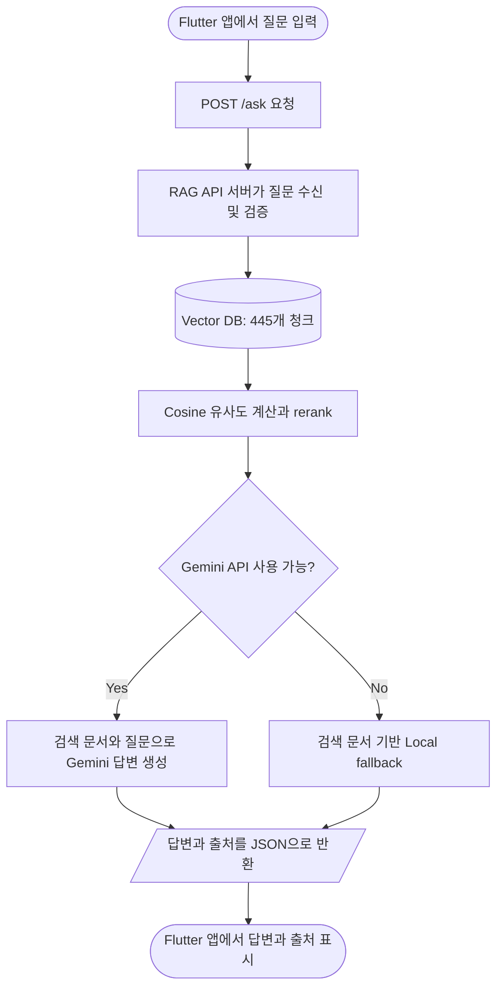

# 시스템 구조

## 요청 처리 흐름

## 구성 요소

### Flutter 앱

- 사용자 질문 입력
- `GET /health`로 서버 연결 상태 확인
- `POST /ask`로 질문 전달
- JSON 응답의 답변과 출처를 화면에 표시

### RAG API 서버

- Flutter 앱과 검색·생성 로직을 연결하는 백엔드
- 질문, `top_k`, LLM 사용 여부 검증
- Vector DB 검색 수행
- Gemini API 호출 또는 Local fallback 선택
- 답변, 출처, 검색 score와 실행 mode 반환

### Vector DB

- 최종 445개 청크와 원문 메타데이터 저장
- 각 문서를 4,096차원 Hash TF-IDF 벡터로 표현
- 질문도 같은 방식으로 벡터화
- 정규화된 벡터의 내적으로 Cosine 유사도 계산

### Rerank

기본 유사도 결과에 다음 규칙을 적용하여 순위를 보정합니다.

- 질문에 명시된 연도
- 졸업학점, 입학, 진로, 과목 등 질문 의도
- 선호·비선호 카테고리
- 과목명과 과목 코드
- 최신 교육과정 및 원문 출처

출처에 표시되는 score는 정답 확률이 아니라, 기본 유사도와 위 보정값을 합친 상대적 검색 관련도입니다.

## Gemini와 Local fallback

Gemini API는 검색된 원문을 읽고 여러 근거를 자연스러운 답변으로 종합합니다. Gemini API 키가 없거나 호출이 실패하면 Local fallback이 검색 상위 문서의 원문을 중심으로 응답합니다. Local fallback은 별도의 로컬 LLM이 아닙니다.
